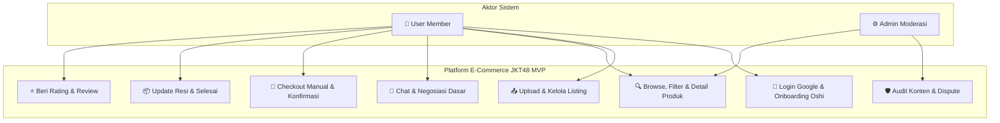
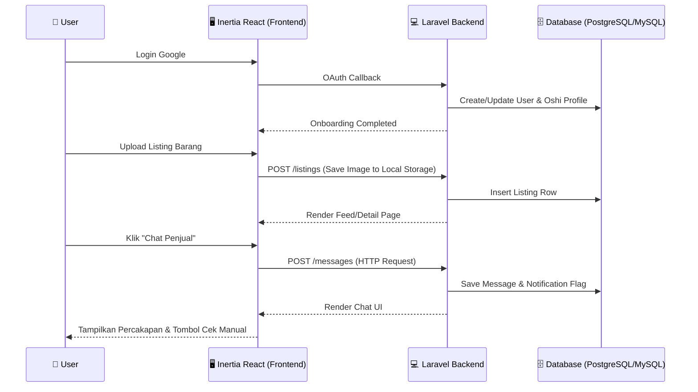
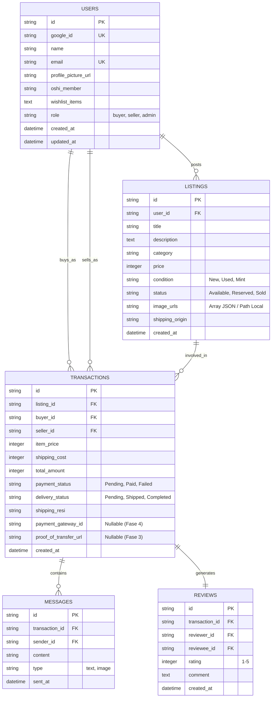

# PRD — Project Requirements Document

## 1. Overview

Aktivitas jual beli _merchandise_ JKT48 (_photocard_, _lightstick_, apparel, dll) saat ini masih tersebar di berbagai platform sosial media dan _marketplace_ umum. Kondisi ini memicu masalah seperti risiko penipuan, harga tidak transparan, kesulitan menemukan barang _rare_, dan tidak adanya ruang yang benar-benar memahami kultur fandom.

Proyek ini bertujuan membangun platform _e-commerce_ terpusat, aman, dan _user-friendly_ yang secara khusus ditujukan untuk komunitas fans JKT48 (Gen Z). Mengadopsi pendekatan **"Healthy MVP"**, pengembangan akan dilakukan secara terukur: fokus pada validasi inti nilai produk (profil fandom, listing barang, dan discoverability) sebelum menambahkan kompleksitas seperti pembayaran otomatis, _real-time chat_, atau cloud storage. UI/UX dirancang agar terasa "kece", intuitif, dan memancing engagement komunitas sejak hari pertama. Monetisasi dan fitur lanjutan akan dieksekusi hanya setelah _user base_, _supply_, dan kepercayaan masyarakat fans terbangun.

## 2. Requirements

- **Bisnis:** Validasi pasar dan akuisisi _supply-demand_ sebagai prioritas utama fase awal. Monetisasi (biaya layanan atau _featured_) ditunda hingga metrik retensi dan kepercayaan terbentuk.
- **Pengguna:** Antarmuka modern responsif, alur registrasi cepat via Google, profil yang menonjolkan identitas fandom (Oshi, wishlist), dan pengalaman _browsing_ yang mulus.
- **Fungsional (MVP Fase 1-2):** Autentikasi Google, Onboarding Profil Oshi, CRUD Listing dengan upload gambar, serta fitur Jelajah/Filter/Detail Produk.
- **Fungsional (MVP Fase 3-4):** Sistem chat internal (HTTP polling → WebSocket), Checkout manual/semi-otomatis, Review pascabeli, Integrasi Payment Gateway, dan migrasi penyimpanan media ke cloud.
- **Keamanan:** Autentikasi terproteksi (Laravel Breeze + Socialite), validasi input ketat, pencegahan serangan umum (CSRF, XSS, SQLi), dan manajemen session yang aman.

## 3. Core Features

### 🔹 Fase 1 & 2: Discovery & Supply (MVP Awal)

- **Autentikasi & Profil Oshi:** Login cepat menggunakan **Google (via Laravel Socialite)**. Pengguna wajib melengkapi profil dengan preferensi Oshi member JKT48, bio singkat, dan badge komunitas sebelum mengakses marketplace.
- **Listing & Upload Media:** Pengguna dapat membuat, mengedit, dan menghapus listing barang dengan foto, deskripsi, harga, dan kategori. Upload gambar disimpan awal di _local filesystem_ untuk kecepatan iterasi.
- **Browse & Detail Produk:** Halaman beranda dengan _feed_ listing terbaru, fitur pencarian, dan filter (nama member, kondisi barang, rentang harga). Halaman detail menampilkan spek barang, status stok, dan info penjual.

### 🔹 Fase 3: Komunikasi & Transaksi Dasar

- **Chat Internal:** Sistem pesan langsung antara pembeli dan penjual menggunakan metode request-response standar (dapat ditingkatkan ke real-time di fase 4).
- **Checkout Manual:** Pembeli memasukkan alamat, memilih metode transfer (Bank/E-Wallet), dan penjual mengonfirmasi pembayaran secara manual di dashboard setelah cek mutasi. Status pesanan diperbarui secara berurutan (Pending → Paid → Shipped → Completed).

### 🔹 Fase 4: Skala & Otomasi

- **Real-time Communication:** Migrasi chat ke **Laravel Reverb** untuk notifikasi dan pesan instan tanpa _refresh_.
- **Payment Gateway & Ongkir Otomatis:** Integrasi Midtrans/Xendit untuk pembayaran otomatis dan RajaOngkir/Biteship untuk kalkulasi biaya kirim _real-time_.
- **Cloud Storage & Review:** Migrasi gambar ke Supabase Storage. Sistem rating bintang dan ulasan muncul otomatis setelah transaksi berstatus "Completed".

## 4. User Flow

**Skenario Core MVP (Fase 1-2): Daftar, Setup Oshi, & Jual/Beli**

1. **Login via Google:** Pengguna masuk dengan satu klik, sistem otomatis membuat akun & mengarahkan ke halaman onboarding profil Oshi.
2. **Setup Profil:** User memilih Oshi favorit, mengisi bio, dan mengunggah avatar. Akses marketplace baru terbuka setelah onboarding selesai.
3. **Jelajahi & Pencarian:** Pengguna menelusuri _feed_ atau mencari barang spesifik (filter berdasarkan nama member, kondisi, harga).
4. **Detail & Kontak:** Klik barang → Lihat spek lengkap → Hubungi penjual via Chat Internal untuk negosiasi atau tanya kondisi.
5. **Checkout Manual:** Tekan "Beli" → Isi alamat → Pilih transfer → Upload bukti bayar. Penjual verifikasi → Update status jadi "Paid" → Kirim barang & input resi.
6. **Selesai & Review:** Pembeli konfirmasi "Barang Diterima" → Status "Completed" → Saling beri rating & ulasan.

## 5. UML Diagrams

### 5.1 Use Case Diagram

Menggambarkan interaksi utama antara Fans (User), Admin, dan Sistem.



### 5.2 Sequence Diagram (MVP: Listing & Chat Manual)

Alur teknis saat pengguna berinteraksi dengan produk dan memulai komunikasi.



## 6. Architecture

Aplikasi menggunakan arsitektur **Monolith SSR/SPA Hybrid** dengan Laravel sebagai inti backend, Inertia.js mengikat React sebagai frontend. Arsitektur diinisialisasi dengan stack ringan untuk validasi cepat, dengan预留 _upgrade path_ yang jelas menuju layanan cloud dan real-time di fase lanjutan.

```mermaid
flowchart TD
    Client([🌐 Web Browser / Pengguna])

    subgraph Laravel_App [Laravel 11 Inertia Stack]
        UI[React Components via Inertia]
        Route[API Routes & Controllers]
        WS[Laravel Reverb Server (Fase 4)]
    end

    subgraph Storage_Layer [Fase 1-3: Local -> Fase 4: Cloud]
        FS[Local Filesystem]
        CS[Supabase Storage (Planned)]
    end

    subgraph Database_Layer [Fase Semua]
        DB[(PostgreSQL / MySQL)]
    end

    subgraph Third_Party [Fase 3-4]
        PG[Midtrans / Xendit]
        OGR[RajaOngkir / Biteship]
        SOC[Google OAuth 2.0]
    end

    Client <-->|HTTP / Inertia Requests| UI
    UI <-->|JSON / Props| Route
    Route <-->|Query / Mutations| DB
    Route <-->|Upload Foto (Awal)| FS
    Route <-->|Upload Foto (Nanti)| CS
    Route <-->|WebSocket Channels (Nanti)| WS
    WS <-->|Real-time Events| Client

    Route <-->|Init Payment (Nanti)| PG
    Route <-->|Hitung Ongkir (Nanti)| OGR
    Route <-->|Auth Callback| SOC
```

## 7. Database Schema

Skema dirancang untuk kompatibel dengan PostgreSQL/MySQL. Kolom `google_id` dan `profile_picture` dioptimalkan untuk autentikasi sosial dan fleksibilitas penyimpanan media.



## 8. Tech Stack

Pilihan teknologi dioptimalkan untuk kecepatan pengembangan, kemudahan hosting, dan ekosistem Laravel modern, dengan strategi adopsi bertahap agar tidak membebani tim di awal.

- **Backend Framework:** Laravel 13 — Robust, Eloquent ORM, dan ekosistem paket yang matang.
- **Frontend:** React + Inertia.js — Menghubungkan Laravel dengan React component modern tanpa perlu REST API terpisah.
- **Authentication:** Laravel Breeze + Laravel Socialite — Setup awal siap pakai, dukungan penuh untuk **Login with Google**.
- **Database:** MySQL atau PostgreSQL — Relasional standar yang stabil. Supabase dapat digunakan sebagai managed PostgreSQL wrapper jika diinginkan, namun koneksi PDO standar cukup untuk awal.
- **Storage:** Filesystem Local (Storage Driver default Laravel) untuk Fase 1-3. Migrasi ke **Supabase Storage** dilakukan di Fase 4 setelah beban gambar meningkat.
- **Communication:** HTTP Standard untuk chat di Fase 3. Upgrade ke **Laravel Reverb** (WebSocket) di Fase 4 untuk _low-latency_ real-time.
- **Payment:** Manual transfer + upload bukti bayar di Fase 3. Integrasi **Midtrans / Xendit** di Fase 4 untuk otomatisasi webhook.
- **Styling & UI:** Tailwind CSS + shadcn/ui — Komponen siap pakai, konsisten, dan estetika Gen Z.
- **Deployment:** Vercel / Railway / PaaS Laravel yang mendukung Node & PHP. Environment variables dikelola terpusat. Supervisor/PM2 disiapkan hanya saat Reverb diaktifkan.

## 9. Implementation Roadmap

Langkah teknis berurutan sesuai pendekatan Healthy MVP untuk membangun fondasi yang stabil dan validasi cepat.

**Phase 1: Environment & Foundation (Week 1-2)**

- Inisialisasi project Laravel 11: `composer create-project laravel/laravel jkt48-market`
- Instalasi Laravel Breeze dengan stack Inertia & React: `php artisan breeze:install react`
- Setup database (PostgreSQL/MySQL) & konfigurasi `.env`
- Instalasi Tailwind CSS & siapkan struktur folder Inertia (`/resources/js/Pages`, `/Components`)
- upload repository ke github kalau belom ada sekalian setupkan
- Output: Stack berjalan lokal, routing in-app siap.

**Phase 2: Auth Google & Profil Oshi (Week 2-3)**

- Konfigurasi Laravel Socialite untuk **Login with Google**
- Buat migrasi `users` tambahan: `google_id`, `oshi_member`, `wishlist`, `profile_image`, `onboarding_completed`
- Bangun halaman onboarding pasca-login: User wajib memilih Oshi & upload avatar sebelum akses marketplace
- Implementasi middleware auth untuk proteksi route jual-beli & chat
- Output: Sistem login aman, onboarding fungsional, data profil ready.

**Phase 3: Marketplace Supply & Discovery (Week 3-5) 🔴 STOP & TEST POINT**

- Buat model & migrasi `listings`. Implementasi upload gambar ke `storage/app/public`
- Bangun fitur CRUD listing: Form upload dengan drag-drop, validasi kategori, status, dan harga
- Implementasi fitur pencarian & filter (nama member, kondisi barang, rentang harga)
- Buat halaman Feed (Beranda) & Halaman Detail Produk menggunakan Inertia + React
- **ACTION:** Release ke grup komunitas beta. Ukur metrics: jumlah listing yang dibuat, frekuensi browsing, retention profil. Jika <30% konversi listing, iterate UI/UX sebelum lanjut.
- Output: Katalog hidup, user bisa menemukan & memamerkan barang.

**Phase 4: Komunikasi & Transaksi Dasar (Week 5-7)**

- Bangun tabel `transactions` & `messages`
- Implementasi Chat Internal sederhana (HTTP Request/Response) dengan polling interval untuk notifikasi baru
- Bangun alur Checkout Manual: Alamat -> Pilih metode transfer -> Upload Bukti -> Penjual Konfirmasi Manual
- Tracking status: Pending → Paid (manual) → Shipped → Completed
- Output: Alur jual-beli tertutup secara manual tapi terstruktur.

**Phase 5: Otomasi & Skala (Week 8+) (Optional based on Phase 3 Validation)**

- Instalasi Laravel Reverb: `composer require laravel/reverb` & migrasi chat ke WebSocket
- Setup Midtrans/Xendit untuk otomatisasi tagihan & webhook. Ganti flow manual.
- Migrasi storage gambar dari Local ke Supabase Storage (gunakan SDK/adapter)
- Implementasi logika Review: Validasi rating 1-5 & komentar setelah `delivery_status = 'Completed'`
- Deploy full-stack, setup monitoring & backup otomatis.

## 10. Development Priority (Where to Start)

Berdasarkan konteks MVP & prinsip pengembangan sehat, fokus eksekusi harus dipertajam agar tidak terjebak dalam "feature paralysis".

1. **Mulai dari: Phase 1 & 2 (Setup Stack + Auth Google + Onboarding Oshi)**
   - **Alasan:** Fondasi platform fandom adalah identitas dan kepercayaan diri user. Dengan Laravel Breeze + Socialite, auth flow aman & cepat. Memaksa user menyelesaikan profil Oshi di awal langsung memberi konteks data untuk kurasi konten, sorting feed, dan personalisasi kedepannya.
   - **Output:** Sistem login terproteksi, halaman onboarding profil, koneksi database berhasil, dan struktur Inertia siap digunakan.

2. **Selanjutnya: Phase 3 (Listing Barang & Browsing Feed)**
   - **Alasan:** Marketplace butuh _supply_ hidup secepatnya. Setelah akun siap, fokus pada kemudahan membuat listing dan menelusuri katalog. Penyimpanan lokal dipakai di awal untuk menghindari biaya & kompleksitas konfigurasi S3/Cloud storage sebelum traffic ada.
   - **Output:** Fitur CRUD listing, halaman katalog yang responsif, dan sistem pencarian dasar berjalan lancar. **DI SINI KITA STOP DULU.**

**🧠 Panduan Validasi (Setelah Phase 3):**
Jangan langsung ke payment atau real-time chat. Lakukan _soft launch_ ke 20-50 user komunitas. Ukur:

- Apakah user konsisten upload listing?
- Apakah mereka menggunakan filter/cari barang?
- Berapa banyak interaksi/chat manual yang muncul?
  Jika metrik stabil, barulah lanjut ke Phase 4 (Chat Dasar & Checkout Manual). Jika userengagement rendah, iterate UI, onboarding, atau mekanisme insentif listing sebelum menambah fitur teknis yang kompleks.

Dokumentasi ini sudah siap menjadi dasar eksekusi teknis yang realistis, aman, dan terukur. Selamat membangun!
