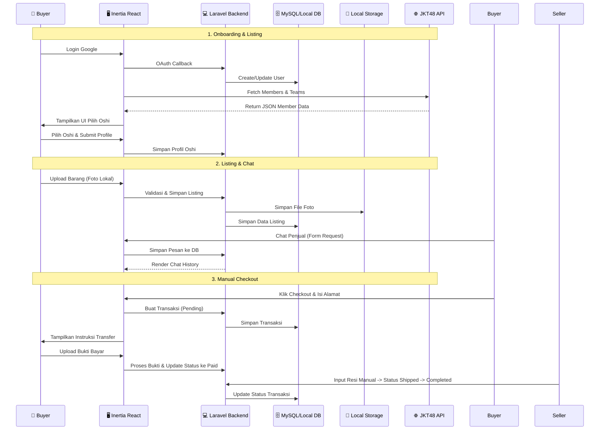
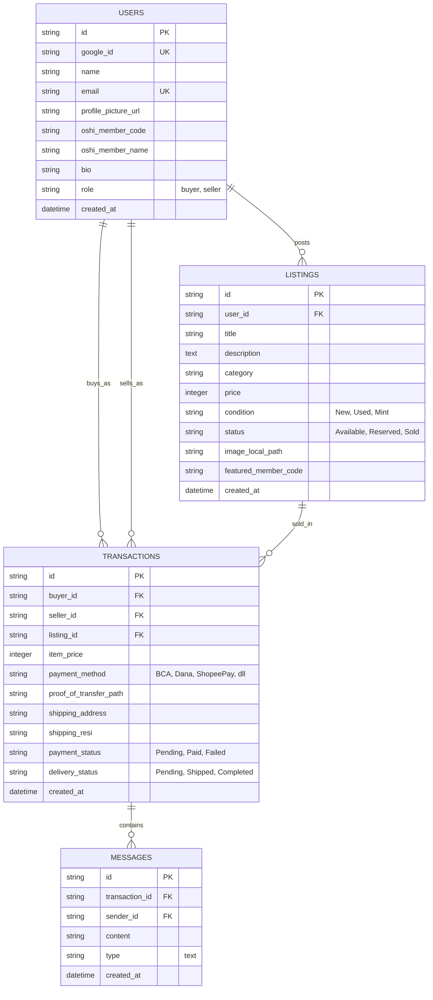

# PRD — Project Requirements Document

## 1. Overview

Aktivitas jual beli _merchandise_ JKT48 (_photocard_, _lightstick_, apparel, dll) saat ini masih tersebar di berbagai platform sosial media dan _marketplace_ umum. Kondisi ini memicu masalah seperti risiko penipuan, harga tidak transparan, kesulitan menemukan barang spesifik, dan tidak adanya ekosistem yang memahami kultur fandom secara mendalam.

Proyek ini bertujuan membangun platform _e-commerce_ yang aman, intuitif, dan khusus dirancang untuk komunitas fans JKT48. Mengadopsi pendekatan **"Healthy MVP"**, pengembangan tahap awal diprioritaskan pada validasi inti nilai produk: identitas fandom yang kuat (profil Oshi berbasis API), kemudahan _listing_ barang, dan _discoverability_ yang dinamis. Fitur kompleks seperti otomatisasi _payment gateway_, migrasi _cloud storage_, dan _real-time chat_ secara resmi dialihkan ke fase lanjutan (Roadmap) untuk memastikan fokus penuh pada kualitas UI/UX, stabilitas alur transaksi manual, dan validasi pengguna di tahap awal.

Integrasi data komunitas akan menggunakan **JKT48 Member API** (`https://jkt-48-member-api-i7i7.vercel.app/`) sebagai sumber data utama untuk memastikan akurasi data member, tim, dan pengalaman onboarding yang dinamis sejak hari pertama. AI Agent pengembang wajib menguasai dan mengimplementasikan standar UI/UX modern di seluruh lapisan antarmuka untuk menghasilkan produk yang terasa familiar dan "kece" bagi generasi Z.

## 2. Requirements

- **Bisnis:** Validasi _supply-demand_, retensi pengguna, dan kepercayaan komunitas sebagai metrik utama sebelum memikirkan monetisasi atau otomatisasi.
- **Pengguna:** Interface modern bergaya Gen Z (wajib pakai library komponen UI), proses login cepat via Google, dan identitas fans yang kuat (sistem Oshi berbasis API eksternal).
- **Fungsional Utama (MVP Fase 1-3):** Autentikasi Google, Onboarding Profil Oshi (fetch data dari API eksternal), CRUD _Listing_ (upload gambar lokal), Search/Filter dinamis (berbasis data API), Chat internal standard (HTTP polling), dan Checkout Manual (upload bukti transfer).
- **Fungsional Lanjutan (Fase 4-5 / Roadmap):** Integrasi Midtrans/Xendit, Otomatisasi hitung ongkir (RajaOngkir/Biteship), Real-time chat (Laravel Reverb/WebSocket), dan Migrasi infrastruktur ke Supabase Storage/DB.
- **Keamanan:** Laravel Breeze + Socialite untuk auth, proteksi CSRF/XSS/SQLi, manajemen session stabil, validasi input sisi server, dan sanitasi data sebelum diproses.
- **Mandat UI/UX:** AI Agent pengembang **WAJIB** mengimplementasikan standar desain modern yang responsif, konsisten, dan memiliki _micro-interaction_ yang halus. Dilarang menggunakan template standar atau styling manual yang tidak terstruktur.

## 3. Core Features (Healthy MVP Focus)

### 🔹 Fase 1: Foundation & External Data Integration

- **Autentikasi Google:** Login satu klik menggunakan **Laravel Socialite**. Pengguna otomatis didaftarkan ke sistem, dan session dikelola aman.
- **Onboarding Profil Oshi (API-Driven):** Setelah login, pengguna wajib memilih member favorit (Oshi) dari data yang diambil real-time dari JKT48 Member API. Pengguna melengkapi bio singkat. Data member (nama, kode unik, tim, generasi) di-_cache_ lokal/aplikasi untuk performa optimal. Ini membangun _fandom presence_ dan fondasi data filter sejak awal.

### 🔹 Fase 2: Supply & Discovery

- **Halaman Products (`/products`) — UI Layer:** Halaman daftar produk dengan grid responsif, filter multi-kriteria (member, tim, kondisi, rentang harga), sorting (terbaru, terlaris, harga), dan paginasi. Saat ini diimplementasikan sebagai halaman "Coming Soon" placeholder; konten penuh (listing nyata dari database) diaktifkan setelah backend Listing Management (CRUD produk) selesai di Fase 2. Navbar sudah memiliki link "Products" yang mengarah ke halaman ini.
- **Listing Management:** Penjual dapat mengunggah foto produk (disimpan di _local filesystem_ `storage/app/public`), deskripsi, harga, kategori, dan _tag member_ yang terkait (berdasarkan kode unik dari API).
- **Browse & Detail:** Fitur eksplorasi barang dengan filter dinamis berdasarkan nama member JKT48, tim (PASSION, LOVE, DREAM, TRAINEE, dll.), kondisi barang (New/Used/Mint), dan rentang harga. Semua opsi filter disinkronkan dengan struktur data dari API eksternal.
- **Search dengan Debounce:** Fitur pencarian (`<input>` search bar) **wajib** mengimplementasikan debounce minimum **300ms** sebelum menembak request ke API atau melakukan filter. Ini mencegah _request flooding_ saat pengguna mengetik cepat, mengurangi beban server, dan menjaga pengalaman interaktif yang smooth. Implementasi menggunakan `useDebounce` hook internal (setTimeout/clearTimeout pattern) — bukan library eksternal. Berlaku di: Navbar global search, halaman Members (`/members`), dan halaman Products (`/products`) saat Phase 2 dilengkapi.

### 🔹 Fase 3: Transaksi Manual & Komunikasi

- **Chat Internal (Standard):** Sistem pesan antar pengguna menggunakan request-response standard (non-real-time) untuk negosiasi harga, tanya kondisi barang, dan koordinasi pengiriman. UI mengadopsi pola bubble chat modern.
- **Checkout Manual:** Pembeli mengisi alamat lengkap, memilih metode transfer bank/e-wallet, dan mengunggah bukti bayar secara manual melalui UI yang intuitif.
- **Order Tracking:** Status pesanan yang dikelola manual oleh penjual & pembeli: _Pending -> Paid (bukti diupload) -> Shipped (resi manual) -> Completed._

### 🔮 Future Roadmap (Setelah Validasi MVP)

Fitur-fitur berikut hanya akan dieksekusi setelah model transaksi manual terbukti aktif dan valid:

- Integrasi Payment Gateway otomatis (Midtrans) & Webhook
- Otomatisasi hitung ongkir (API RajaOngkir/Biteship)
- Migrasi media & database ke **Supabase (PostgreSQL + Storage)**
- Implementasi **Laravel Reverb** untuk chat real-time (WebSocket)
- Sistem Rating, Review, & Reputasi Penjual

## 4. User Flow

**Skenario Jual-Beli (MVP Flow):**

1. **Login via Google:** Pengguna masuk, sistem membuat akun. Jika belum punya profil, diarahkan ke halaman Onboarding.
2. **Setup Oshi (API):** Sistem mengambil data member dari JKT48 Member API. Pengguna memilih Oshi utama, tim, dan melengkapi bio singkat. Data disimpan ke profil.
3. **Jelajahi & Pencarian:** Pengguna menelusuri _feed_. Filter otomatis tersedia berdasarkan Tim, Nama Member, Kondisi, dan Harga (data sinkron dengan API).
4. **Negosiasi (Manual):** Pembeli klik "Chat" ke penjual. Percakapan berjalan via form request-response standard di dalam aplikasi.
5. **Checkout & Bukti Bayar:** Pembeli klik "Beli Sekarang", isi alamat, pilih metode transfer (BCA/Dana/GoPay dll), lalu upload screenshot/foto bukti transfer.
6. **Konfirmasi & Kirim:** Penjual menerima notifikasi, memverifikasi bukti transfer manual, mengubah status ke _Paid_, mengemas barang, menginput resi manual, dan mengubah status ke _Shipped_.
7. **Selesai:** Pembeli klik "Barang Diterima". Transaksi tertutup. Fase awal tidak menggunakan rating/review otomatis untuk mengurangi friction.

## 5. UML Diagrams

### 5.1 Use Case Diagram

```mermaid
graph TD
    subgraph Actors
        U[👤 User/Fans]
        A[⚙️ Admin Moderasi]
        AP[🌐 JKT48 Member API]
    end

    subgraph MVP_Core [Healthy MVP Scope]
        UC1[🔐 Login Google & Fetch Data Oshi]
        UC2[📤 Upload Listing + Tag Member]
        UC3[🔍 Browse & Filter Dinamis (API Data)]
        UC4[💬 Chat Standard (HTTP)]
        UC5[🛒 Checkout Manual & Upload Bukti]
        UC6[📦 Update Status Transaksi]
    end

    U --> UC1
    U --> UC2
    U --> UC3
    U --> UC4
    U --> UC5
    U --> UC6
    A --> UC3
    A --> UC6
    UC1 -.-> AP
    UC2 -.-> AP
    UC3 -.-> AP
```

### 5.2 Sequence Diagram (Manual Transaction Flow)



### 5.3 Database Schema



## 6. Tech Stack

Pilihan teknologi dioptimalkan untuk kecepatan pengembangan MVP, kemudahan debugging lokal, dan ekosistem Laravel modern.

- **Backend Framework:** Laravel 13 — Robust, Eloquent ORM, dan ekosistem paket yang matang.
- **Frontend:** React + Inertia.js — Menghubungkan Laravel dengan React component modern tanpa perlu REST API terpisah.
- **Authentication:** Laravel Breeze + Laravel Socialite — Setup cepat, dukungan penuh untuk **Login with Google**.
- **Database:** MySQL / PostgreSQL (Lokal awal) — Relasional, stabil, dan mudah dikelola untuk fase validasi.
- **Storage:** Local Filesystem (`storage/app/public`) — Digunakan untuk menyimpan foto merchandise saat MVP. Migrasi ke cloud akan dilakukan di fase lanjutan.
- **Styling & UI:** Tailwind CSS + **shadcn/ui** — Wajib digunakan untuk komponen modern (Cards, Combobox, Dialog, Table). Memastikan estetika Gen Z, spacing konsisten, dan _state feedback_ yang tepat.
- **External Data Source:** **JKT48 Member API** (`https://jkt-48-member-api-i7i7.vercel.app/`) — Sumber utama untuk data member, tim, dan filter kategori.
- **Development Priority Mandate:** AI Agent pengembang **WAJIB** menguasai dan mengimplementasikan standar UI/UX modern. Dilarang menggunakan desain HTML/CSS standar atau template jadul. Konsistensi _shadcn/ui_ + Tailwind, tipografi, micro-interaction, dan manajemen loading/error state adalah prioritas utama.

## 7. Implementation Roadmap

### **Step 1: Setup & API Integration (Week 1)**

- Instalasi Laravel 13 dengan Breeze Inertia-React.
- Konfigurasi Google OAuth via Socialite & setup database lokal.
- **API Integration:** Buat service/fetcher di sisi klien (Inertia/React) untuk menarik data dari `GET /api/members` dan `GET /api/teams`. Implementasi caching sederhana agar tidak membebani API eksternal.
- **UI/UX Task:** Implementasikan flow onboarding yang polished untuk pemilihan Oshi menggunakan komponen _Combobox/Cards_ dari shadcn/ui. Pastikan transisi halaman mulus dan feedback visual jelas.

### **Step 2: Supply & Discovery (Week 2-3)**

- Implementasi CRUD Listing & Fitur Pencarian.
- Setup file storage driver ke `local` untuk simpan foto merchandise.
- Sinkronisasi filter frontend dengan struktur data dari API (tim, member code).
- **UI/UX Task:** Desain _Feed_ merchandise yang clean dan responsif. Gunakan _skeleton loaders_ untuk transisi data, pastikan grid produk intuitif, dan terapkan hierarki tipografi yang sesuai target Gen Z.

### **Step 3: Manual Transaction Flow (Week 4)**

- Pembuatan tabel transaksi dan pesan. dan pastikan semua produk dummy dihapus diganti dengan realtime di database jadi harusnya kosong dan untuk yg di awal hero section kan kaya ada photocard ngambang yang disamping(Koleksi Merch
  JKT48 Impianmu
  Ada di Sini ✨) gitu nanti aku ganti jadi ada macem macem produknya kamu bisa check di public image ada pc, lighstick, birthday tshirt, atau tshirt lainnya, ya yang ada nanti aku taro di public, image, heroassets
- Alur upload bukti bayar dan konfirmasi seller di dashboard.
- Chat internal berbasis request-response standar. di navbar ada icon chat nah nanti chatnya disitu dibuat halaman baru aja nanti ketahuan user yg ngechat siapa aja namanya ketika dibuka baru muncul chatnya.
- **UI/UX Task:** Bangun UI Chat yang familiar (bubble, timestamp, indicator sent/read). Pastikan UX checkout manual minim friction, dengan progress indicator status pesanan yang jelas.

### **Step 4: Evaluation & Scaling (Next Phase)**

- **Validasi:** Analisis apakah user konsisten upload dan buy. Cek retention rate.
- **Execution:** Jika valid, mulai integrasi Payment Gateway (Midtrans), hitung ongkir otomatis, migrasi storage ke cloud, dan implementasi Laravel Reverb.

## 8. Development Priority (Guiding Principles)

1. **Pentingnya UI/UX & AI Skill Mandate:** AI Agent pengembang **WAJIB** menguasai dan mengimplementasikan standar UI/UX modern. Dilarang menggunakan desain HTML/CSS standard atau template jadul. Wajib menggunakan **shadcn/ui** + Tailwind untuk memberikan kesan produk profesional, polished, dan sesuai dengan estetika Gen Z sejak hari pertama. Konsistensi spacing, typography, micro-interaction, dan state feedback (loading/error/empty) adalah prioritas utama.
2. **KISS (Keep It Simple, Stupid):** Jangan menyentuh `broadcasting`, `webhook payment`, `cloud SDK`, atau migrasi database sebelum fitur upload barang, filter member, dan checkout manual berjalan 100% tanpa bug.
3. **Fandom & Data Centric:** Pastikan atribut member JKT48 (Oshi, Tim, Generasi) yang diambil dari API muncul sebagai elemen filter utama dan identitas visual di setiap halaman. Data member adalah fondasi discoverability.
4. **Healthy MVP Scope:** Fitur Supabase, Payment Gateway, dan Real-time Chat resmi berada di _Future Roadmap_. Fokus 100% pada validasi alur jual-beli manual dan kualitas antarmuka sebelum melakukan scaling infrastruktur.
