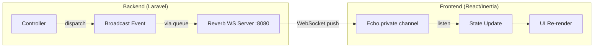

# Walkthrough: Laravel Reverb WebSocket — OshiMerch

## Overview

Berhasil mengintegrasikan **Laravel Reverb v1.10.1** sebagai WebSocket server self-hosted untuk OshiMerch. Semua fitur real-time (chat, notifications, transaction status) sekarang menggunakan WebSocket, bukan polling HTTP.

## Architecture



## Files Created (7 new files)

| File | Purpose |
|---|---|
| [DirectMessageSent.php](file:///c:/laragon/www/OshiMerch/app/Events/DirectMessageSent.php) | Broadcast direct chat messages on `private-conversation.{id}` |
| [NewNotification.php](file:///c:/laragon/www/OshiMerch/app/Events/NewNotification.php) | Broadcast notifications on `private-notifications.{userId}` |
| [TransactionStatusUpdated.php](file:///c:/laragon/www/OshiMerch/app/Events/TransactionStatusUpdated.php) | Broadcast status changes on `private-transaction.{id}` |
| [TransactionMessageSent.php](file:///c:/laragon/www/OshiMerch/app/Events/TransactionMessageSent.php) | Broadcast transaction chat on `private-transaction.{id}` |
| [channels.php](file:///c:/laragon/www/OshiMerch/routes/channels.php) | Authorization rules for all 4 channel types |
| [broadcasting.php](file:///c:/laragon/www/OshiMerch/config/broadcasting.php) | Broadcasting config (auto-generated) |
| [reverb.php](file:///c:/laragon/www/OshiMerch/config/reverb.php) | Reverb server config (auto-generated) |

## Files Modified (10 files)

### Backend
| File | Change |
|---|---|
| [composer.json](file:///c:/laragon/www/OshiMerch/composer.json) | Added `laravel/reverb`, updated dev script to include Reverb server |
| [package.json](file:///c:/laragon/www/OshiMerch/package.json) | Added `laravel-echo` + `pusher-js` |
| [.env](file:///c:/laragon/www/OshiMerch/.env) | Added `BROADCAST_CONNECTION=reverb` + all `REVERB_*` and `VITE_REVERB_*` vars |
| [.env.example](file:///c:/laragon/www/OshiMerch/.env.example) | Same Reverb vars template |
| [bootstrap/app.php](file:///c:/laragon/www/OshiMerch/bootstrap/app.php) | Registered `channels.php` route |
| [ConversationController.php](file:///c:/laragon/www/OshiMerch/app/Http/Controllers/ConversationController.php) | Dispatch `DirectMessageSent` + create notification on send |
| [TransactionController.php](file:///c:/laragon/www/OshiMerch/app/Http/Controllers/TransactionController.php) | Dispatch `TransactionStatusUpdated` in 4 methods |
| [MessageController.php](file:///c:/laragon/www/OshiMerch/app/Http/Controllers/MessageController.php) | Dispatch `TransactionMessageSent` on send |
| [Notification.php](file:///c:/laragon/www/OshiMerch/app/Models/Notification.php) | Dispatch `NewNotification` in all 5 factory methods |

### Frontend
| File | Change |
|---|---|
| [bootstrap.js](file:///c:/laragon/www/OshiMerch/resources/js/bootstrap.js) | Setup Echo + Reverb WebSocket connection |
| [Navbar.jsx](file:///c:/laragon/www/OshiMerch/resources/js/Components/Navbar.jsx) | **Replaced 30s polling** with Echo listener on `private-notifications.{userId}` |
| [Chat/Direct.jsx](file:///c:/laragon/www/OshiMerch/resources/js/Pages/Chat/Direct.jsx) | Added Echo listener on `private-conversation.{id}`, local state for messages |
| [Transactions/Show.jsx](file:///c:/laragon/www/OshiMerch/resources/js/Pages/Transactions/Show.jsx) | Added Echo listener for both `TransactionStatusUpdated` + `TransactionMessageSent` |

## Key Design Decisions

1. **`toOthers()` on chat broadcasts** — The sender's message is handled by Inertia's redirect (`back()`), while the *other* party gets it via WebSocket. This prevents duplicate messages.

2. **Duplicate prevention** — All Echo listeners check `prev.some(m => m.id === e.id)` before appending, because Inertia might re-render with fresh server data at the same time a WebSocket event arrives.

3. **Local state pattern** — Props from Inertia are copied to `useState()` so WebSocket events can mutate them without requiring a full Inertia page visit.

4. **Presence channel prepared** — `channels.php` includes `presence-conversation.{id}` authorization, ready for online indicators + typing when needed.

## Verification

- ✅ **Vite build**: Compiles without errors
- ✅ **All 4 events**: Implement `ShouldBroadcast` with proper channel + payload

## How to Run

```bash
# Start everything (server + queue + vite + reverb + logs)
composer dev
```

This runs 5 concurrent processes:
- `php artisan serve` — HTTP server (:8000)
- `php artisan queue:listen` — Queue worker
- `php artisan pail` — Log viewer
- `npm run dev` — Vite dev server
- `php artisan reverb:start --debug` — WebSocket server (:8080)

## Testing Real-Time

1. Open **2 different browsers** (e.g., Chrome + Edge)
2. Log in as different users
3. Open a direct chat → Send a message → Should appear instantly on the other side
4. Check the bell icon → Notification should push without refresh
5. Open a transaction → Change status → Should update live on both sides
